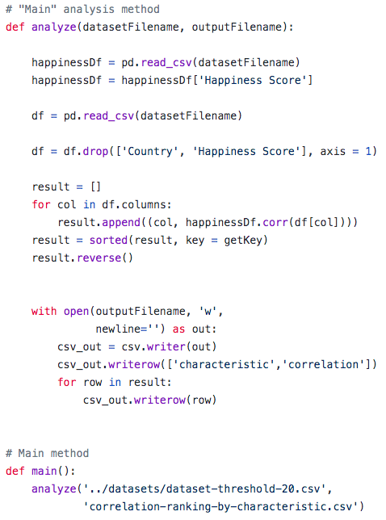
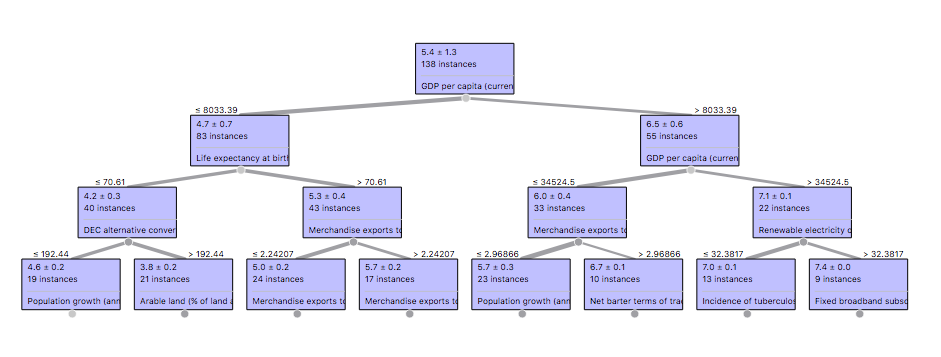

# The Happiness Project

## Pinpointing the factors that make countries the happiest!
Inspired by the 2020 Hacklytics' theme of **analyzing data for social good**, we focused on people's perception of countries around the world. We wanted to
1. Determine which significant socioeconomic factors have the most effect on a country's happiness, and
2. Create a model that accurately predicts the happiness value of any given country based on 10-20 of its socioeconomic factors. 

## What We Accomplished
At the conclusion of the hackathon/datathon, we were able to create a lasso regression that had a **~73% accuracy** of predicting a nation's happiness value. We further identified **10 of the most important socioeconomic development factors** that affected a country's happiness score, listed as follows:
1. Life expectancy of females at birth
2. Urban population (% of total population)
3. Access to electricity (% of population)
4. People using at least basic water drinking services
5. Birth rate, crude
6. GDP per capita (constant 2010 US$)
7. Urban population
8. Urban population growth
9. Fixed broadband subscriptions
10. Incidence of tuberculosis (per 100,000 people)

This project was created by [Chris Fan](github.com/chrisfence), [Jinghan (Michael) Chen](github.com/Michaelchen1116), [Garcia (Hung-Wei) Lu](github.com/gargargargar), and [Michael Oh-Yang](github.com/michaelohyang).

## Phase 1 - Identifying Datasets

We initially identified [World Bank's World Development Indicators](https://datacatalog.worldbank.org/dataset/world-development-indicators) as a major reference dataset. We realized that we wanted to utilize this comprehensive set of data, which includes around 1400 different features for a nation and up to 50 years worth of datapoints, to find out how different socioeconomic factors affect people's lives and how indicative these factors can be of people's lives.

We researched further to find out what would be a good indicator for people's quality of lives, and we discovered the [World Happiness Report](https://www.kaggle.com/unsdsn/world-happiness) dataset available on Kaggle. Our goal now focused on
1. determining correlation between the development indicators and the happiness scores, and
2. creating a regression that can predict happiness scores based on the development indicators.

## Phase 2 - Dataset Cleaning
While the World Development Indicators (WDI) dataset was relatively comprehensive, there were still a fair number (out of 1400) of features that were significantly lacking in data availability. Based on the fact that our happiness value dataset only contained data from 2015-2018, we cleaned the WDI dataset to
1. only contain data form 2015-2019, and
2. only contain features lacked data for no less than 20 countries.

In consideration of future model-building, we decided to pick 15 indicators out of the 100 we have left after data cleaning. We achieved this through
1. analyzing the correlation between the 100 indicators and the happiness score, and 
2. using Anaconda's Orange to create a decision tree. 

## Phase 3 - Lasso Regression
With the now-clean dataset, we plugged each countries happiness scores and development indicators into [`scikit-learn`'s lasso regression model](https://scikit-learn.org/stable/modules/generated/sklearn.linear_model.Lasso.html). We tested a few test size values to optimize the result, and our final model, using a test size of 0.2, yielded a accuracy rating of 73%. We also identified the most influential factors as determined by our lasso regression, listed by our [results](##markdown-header-what-we-accomplished).

## References

### Dataset Sources
- [World Bank's World Development Indicators](https://datacatalog.worldbank.org/dataset/world-development-indicators)
- [World Happiness Report](https://www.kaggle.com/unsdsn/world-happiness)
